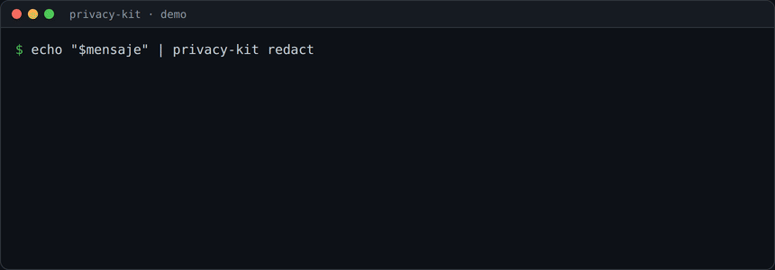
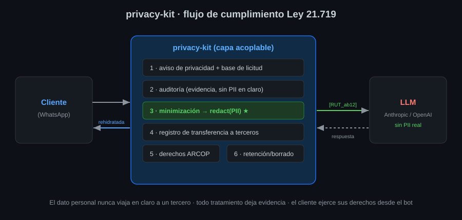

# privacy-kit-cl 🛡️

> Cumplimiento de la **Ley 21.719** (protección de datos, Chile) para sistemas con **IA/LLMs** — sin reescribir lo que ya funciona.

  

<p align="center">
  
</p>

<p align="center"><i>La PII (RUT, teléfono) se enmascara <b>antes</b> de tocar el LLM, y se rehidrata solo en la respuesta al cliente.</i></p>

Módulo **independiente y reutilizable** para cumplir la **Ley 21.719** (Protección de Datos Personales de Chile) en cualquier sistema que trate datos personales — especialmente sistemas con **IA/LLMs** que interactúan con terceros (clientes).

La idea: en vez de reimplementar el cumplimiento en cada proyecto, se **acopla** este kit como una capa transversal. Un desarrollador (o una IA) instala el paquete, lo configura con un archivo declarativo, y envuelve los puntos donde entra/sale/procesa un dato personal.

## Qué resuelve (mapeo a la ley)

| Componente | Artículo/principio 21.719 | Qué hace |
|---|---|---|
| `consent` | Base de licitud, consentimiento | Captura y registra consentimiento con evidencia (quién, cuándo, para qué). |
| `redaction` | Minimización, seguridad | Detecta y **anonimiza PII antes de mandarla a un LLM** o a terceros. |
| `rights` | Derechos ARCOP+ | Handlers de Acceso, Rectificación, Cancelación/supresión, Oposición y Portabilidad. |
| `retention` | Calidad, plazos | Políticas de retención y borrado automático (derecho al olvido). |
| `transfers` | Transferencia a terceros | Registro de a qué terceros (OpenAI, Anthropic, pasarelas…) se envían datos. |
| `audit` | Responsabilidad proactiva | Bitácora inmutable de cada acceso/tratamiento de dato personal. |
| `notice` | Transparencia | Genera el aviso de privacidad y su entrega en el primer contacto. |

## Cómo funciona

<p align="center"></p>

## Principios de diseño

1. **Independiente:** no depende de tu framework. Core en Python puro + interfaces de almacenamiento (`store/base.py`) que adaptas a Mongo, ClickHouse, Postgres, etc.
2. **Declarativo:** todo el comportamiento sale de un `privacy.config.yaml` (categorías de datos, finalidades, plazos, terceros). Cambiar la política = cambiar config, no código.
3. **Acoplable por envoltura:** envuelves las llamadas sensibles (`@guard`, `redact(...)`, `audit(...)`) sin reescribir tu lógica.
4. **AI-friendly:** el archivo [`AGENTS.md`](AGENTS.md) le dice a una IA exactamente cómo integrar el kit en un sistema nuevo o existente.

## Quickstart

```bash
pip install -e .
```

```python
from privacy_kit import PrivacyKit

pk = PrivacyKit.from_config("privacy.config.yaml")

# 1) Antes de mandar texto de un cliente a un LLM:
safe_text, tokens = pk.redaction.redact(user_message, subject_id=rut)

# 2) Registrar la transferencia al proveedor del modelo:
pk.transfers.log(subject_id=rut, destino="anthropic", finalidad="asistencia_venta")

# 3) Auditar el acceso:
pk.audit.record(subject_id=rut, accion="procesar_mensaje", sistema="mcp_ecommerce")
```

Ver [`examples/mcp_integration.py`](examples/mcp_integration.py) para el caso real del bot de WhatsApp.

## Estado

Scaffold base (esqueleto funcional con interfaces y stubs). Diseñado para crecer proyecto a proyecto. No es asesoría legal — validar con abogado antes de producción.
